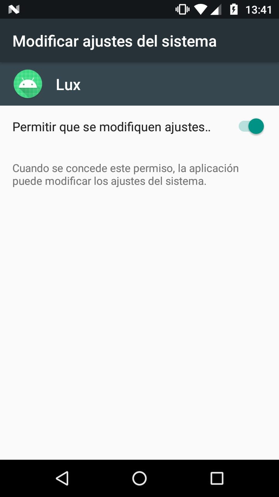
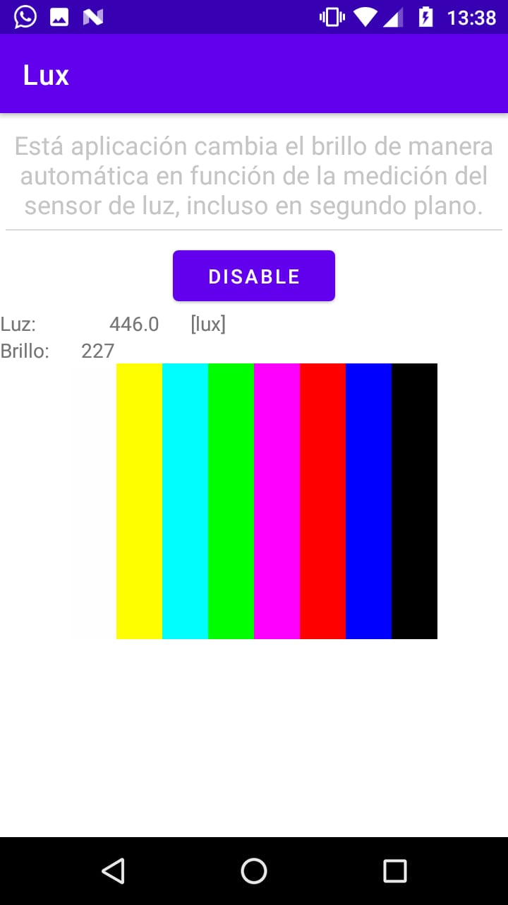

# medidas1_android
Aplicación que toma mediciones del sensor de luz y cambia el brillo de la pantalla.

## Uso
1. Al iniciar por primera vez la aplicación en un nuevo dispositivo, se pedirán permisos para modificar las configuraciones del sistema. Dados los permisos, se debe cerrar la aplicación y volverla a abrir.

2. Luego, ya podrá usar la aplicación de manera normal. El botón de "Enable / Disable" habilita o deshabilita la modificación del brillo por parte de la APP **en segundo plano**, dentro de la aplicación siempre se encuentra habilitado.

## Autores
* Nicolas Gabriel Cotti
* Felipe Nirino
* Francisco Burnes Ciccala
* Pedro Yañéz